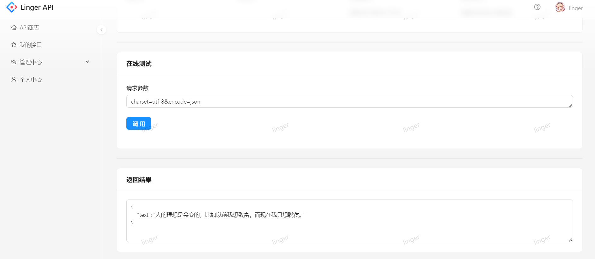

# Linger API开放平台

提供API接口供开发者调用的平台，基于Spring Boot后端 + Ant Design Pro前端的全栈项目。
管理员可以接入并发布接口、可视化各接口的调用情况；用户可以注册登录并开通接口调用权限、浏览接口、在线
调试，而且还能够使用客户端SDK轻松在代码中调用接口。

在线体验地址：[Linger API](http://liu-lian.com.cn)

后端开源地址：https://github.com/insist-youself/linger-api-backend

## 项目展示


- 登录页面
  
- 接口商店
  
- 我的接口
  
- 接口调用
  
  
- 接口管理
  
- 用户管理
  
- 接口分析
  
- 个人中心
  

## 目录结构


| 目录                                                | 描述        |
|---------------------------------------------------|-----------|
| 🏘️ [linger-api-backend](linger-api-client-sdk)   | API后端服务模块 |
| 🏘️ [linger-api-common](linger-api-common)        | 公共服务模块    |
| 🕸️ [linger-api-gateway](linger-api-gateway)      | 网关模块      |
| 🔗 [linger-interface](linger-interface)           | 接口模块      |
| 🛠 [linger-api-client-sdk](linger-api-client-sdk) | 开发者调用sdk  |

## 系统架构


## 技术选型


### 后端

- Spring Boot
- Spring MVC
- MySQL 数据库
- Redis 缓存
- 阿里云OSS 存储
- Dubbo 分布式（RPC、Nacos）
- Spring Cloud Gateway 微服务网关
- API 签名认证（Http 调用）
- Swagger + Knife4j 接口文档
- Spring Boot Starter（SDK 开发）
- Spring Session Redis 分布式登录
- Apache Commons Lang3 工具类
- MyBatis-Plus 及 MyBatis X 自动生成
- Hutool、Apache Common Utils 等工具库

### 前端

- React 18
- Ant Design Pro 5.x 脚手架
- Ant Design 组件库
- Umi 4 前端框架
- OpenAPI 前端代码生成

## 功能模块


- 用户、管理员
  - 登录注册
  - 个人主页，包括上传头像，显示密钥，重新生成ak,sk
  - 管理员：接口管理
  - 管理员：用户管理
  - 管理员：接口分析

- 接口
  - 浏览接口信息
  - 🌟 签名算法校验接口调用权限
  - 🌟 SDK调用接口
  - 接口搜索

## 快速上手


### 后端

1. 将各模块配置修改成你自己本地的端口、账号、密码
2. 启动 Nacos、Mysql、Redis
3. 将公共服务 linger-api-common 以及 linger-api-client-sdk 安装(Maven下的install)到本地仓库
4. 按顺序启动服务

服务启动顺序参考：

1. linger-api-backend
2. linger-api-gateway
3. linger-interface

### 前端

环境要求：Node.js >= 16

安装依赖：
````
yarn
````

启动：
````
npm run start:dev
````

## 欢迎贡献与交流
项目需要大家的支持，期待更多小伙伴的贡献，你可以：

对于项目中的Bug和建议，能够在Issues区提出建议，我会积极响应
